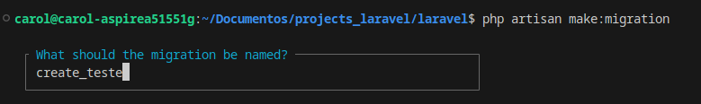

##### MIGRATIONS

- Migrations funcionam como um versionamento do banco de dados
- Cada migration representa uma alteração no banco de dados
- As migrations são executadas em ordem cronológica
- As migrations podem ser revertidas
- As migrations podem ser executadas manualmente
- As migrations podem ser executadas automaticamente
- As migrations podem ser executadas em diferentes ambientes
- As migrations podem ser executadas em diferentes versões do banco de dados
- As migrations podem ser executadas em diferentes plataformas
- As migrations podem ser executadas em diferentes linguagens de programação



### Comando para verificar migrations

```bash
php artisan migrate:status
```
### Comando para executar migrations
```bash
php artisan make:migration
```
### Comando para reverter migrations e criar novamente
```bash
php artisan migrate:fresh
```
- Cuidado ao usar o comando `migrate:fresh` pois ele apaga todas as tabelas do banco de dados e executa as migrations novamente.

- Cuidado ao usar o comando `migrate:reset` pois ele apaga todas as tabelas do banco e reexecuta todas as migrations

- Cuidado ao usar o comando `migrate:rollback` pois ele apaga a última migration executada

- migrate:refresh : é usado para apagar todas as tabelas e reexecutar todas as migrations

- Fazer modificaçoes na estrutura do banco

- Criar tabela, alterar tabela, criar índice, criar chave primária, criar chave estrangeira.

### Como adicionar campo 

```
php artisan make:migration add_category_to_teste
```

### Rodar migração

```bash
php artisan migrate
```