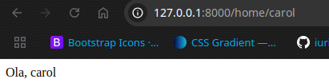

### Parametros dinamicos

```php
Route::get('/home/{text}',function($text){
    echo 'Ola, '.$text;
});
```

O caminho **'/home/{text}'** define que essa rota aceita um parâmetro dinâmico chamado {text}.

Output:



´´´ php
Route::get('/products/{id}',function($id){
    return view('item-product',['id'=> $id]);
});

Route::get('/products-test/{id?}', function($id = null){
    return view('product',['id'=>$id]);
});

Route::get('/products-search', function(){
    $busca = request('search');
    return view('product-search', ['busca'=>$busca]);
});
´´´